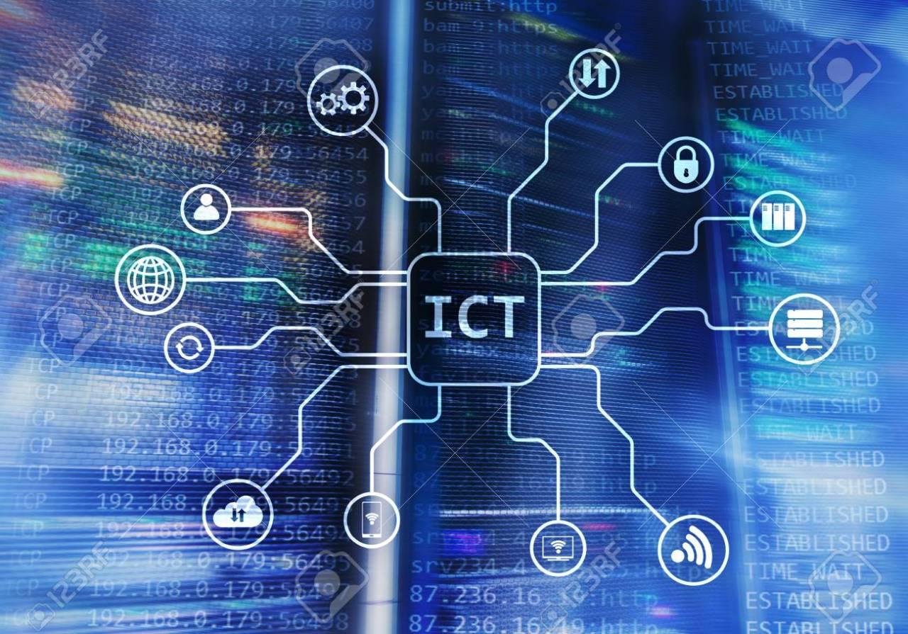

# ICT 란?

## ICT의 정의\(WIKIPEDIA\)



정보통신기술\(ICT\)은 통합통신의 역할과 통신\(전화선 및 무선신호\)과 컴퓨터의 통합을 강조하는 정보기술\(IT\)의 연장어로서, 이를 가능하게 하는 필요한 기업용 소프트웨어, 미들웨어, 저장, 시청각 시스템 등을 말한다.

🤷‍♀️ ~~_그렇다면 도대체 ICT를 적용한 기술은 뭔데? ICT 정의를 봐도 뭔 소리인지 모르겠음!_~~  
== ICT에 대해서 좀 더 자세하게 들여다보자.

🔗 IT가 ‘정보’ 자체에 초점이 맞추어져 있었다면, ICT는 _**정보 간의 Communication**_, 정보간 통신을 해가며 새로운 가치를 발견하는 것에 초점이 맞추어져 있다. 스마트 TV를 예로 들어보자. 내가 주로 이 시간대에 보는 프로그램, 나에 맞추어진 취향의 영화 등을 추천해준다. _**‘나의 활동＇이라는 정보**_를 받아들이고 _**이에 맞는 정보들을 제공**_한다는 점에서 ‘_**정보 간의 통신, 대화’**_가 이루어진 것이다. 따라서, _**ICT의 등장은 점점 Personal Service가 중요해졌음을 의미한다.**_  
🤓 대충 보아하니 '빅 데이터', '사물 인터넷'과 관련 된 용어인 것 같네

🔗 ICT 분야에서는 최근에 BMW가 화두가 되고 있다 _--아마도 2015년 부터 꾸준히_.  
_**BMW는 빅데이터\(Big Data\), 모바일\(Mobile\), 웨어러블\(Wearable\)을 의미하는 신조어**_다. 모든 서비스를 _**데이터로 치환하여 맞춤형, 개인형 서비스로 탈바꿈하여 제공**_하는 것은 이제 우리가 대중\(Mass\)의 시대에서 _**개인\(Personal\) 시대로 들어가는 기술적인 기반**_이 된다.

🔗 ICT의 발전을 통해 우리 사회는 진정한 _**‘초연결 사회’를 구현**_하는 방향으로 변화하고 있다. 인간과 인간, 인간과 사물, 사물과 사물이 인터넷과 모바일로 연결되는 이러한 초연결 사회야말로 창조경제가 구현될 수 있는 기반이다. _**즉, ICT는 창조경제의 핵심 기반**_이라고 말할 수 있다.  
🤓 일단 어떤 의미인지는 알겠고, 적용 기술에는 어떤 것이 있을까?

## ICT 기술 및 트렌드

[https://blog.lgcns.com/1917](https://blog.lgcns.com/1917) -LG CNS IT뉴스 발췌

🔗 ICT 관련 기술에는 _**'인공지능', '5G', 'AR', 'VR'**_ 이 있고, 산업적 측면에서 주요 기업들이 이러한 기술들을 자동차, 스마트 팩토리 등과 같은 분야에 적용해 새로운 비즈니스 모델을 창출하고 있다고 한다.  
📌 인공지능 : 인공지능\(artificial intelligence 혹은 machine intelligence\)은 시스템에 의해 만들어진 지능을 뜻한다. 이 용어는 또한 그와 같은 지능을 만들 수 있는 방법론이나 실현 가능성 등을 연구하는 과학 분야를 지칭한다. \(출처-위키피디아\)

```text
  📌 5G : 5G는 4G와 비교할 때 훨씬 빠른 데이터 전송률과 매우 낮은 지연 시간을 약속하는 차세대 모바일 네트워크이며, 오늘날의 최선형 모바일 네트워크에서는 불가능한 광범위한 새로운 서비스군을 전달할 수 있다. \(출처-CIENA\)  
          ⚙ **4G와의 비교를 통한 5G의 개선점**   
               💡  훨씬 빨라진 데이터 전송률  
               💡   매우 낮은 지연 시간  
               💡   센서와 같은 수십억 개의 '사물' 지원  
               💡   자율 주행 자동차 지원  

  📌 AR / VR :    
       **증강현실**\(augmented reality, **AR**\)은 [가상현실]의 한 분야로 실제로 존재하는 환경에 가상의 사물이나 정보를 합성하여 _**마치 원래의 환경에 존재하는 사물처럼 보이도록 하는**_ [컴퓨터 그래픽] 기법이다.   
        **가상현실**\(virtual reality, **VR**\)은 컴퓨터 등을 사용한 인공적인 기술로, _**만들어낸 실제와 유사하지만 실제가 아닌 어떤 특정한 환경이나 상황 혹은 그 기술 자체**_를 의미한다.  
```

이때, 만들어진 가상의\(상상의\) 환경이나 상황 등은 사용자의 오감을 자극하며 실제와 유사한 공간적, 시간적 체험을 하게 함으로써 현실과 상상의 경계를 자유롭게 드나들게 한다.  
\(출처-위키피디아\)

